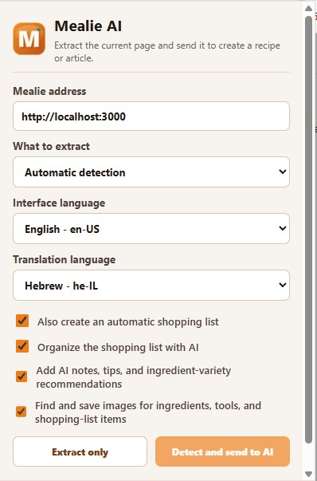

[![Latest Release][latest-release-shield]][latest-release-url]
[![Contributors][contributors-shield]][contributors-url]
[![Stargazers][stars-shield]][stars-url]
[![Issues][issues-shield]][issues-url]
[![AGPL License][license-shield]][license-url]
[![Docker Pulls][docker-pull]][docker-url]
[![GHCR Pulls][ghcr-pulls]][ghcr-url]

> [!IMPORTANT]
> This repository is a customized fork of [Mealie](https://github.com/mealie-recipes/mealie), focused on AI-assisted recipe creation, cookbook translation and extraction, richer shopping-list workflows, Hebrew/RTL usability, and local-first media management.
> See [FORK_CHANGES.md](FORK_CHANGES.md) for the complete feature list, implementation notes, stability review, and verification results.

## Fork Highlights

- Create structured recipes and shopping lists with AI from text, links, images, videos, books, and browser-extracted pages.
- Translate full cookbooks, extract recipes by page range, resume long-running jobs, and distribute work across multiple Gemini API keys.
- Manage uploaded and translated cookbook libraries, AI-generated cookbooks, articles, recipe media, background jobs, and source-page links.
- Use expanded shopping-list workflows including AI organization, inline editing, search, bulk deletion, and merging any number of lists while preserving their sources.
- Use the Hebrew/RTL interface or any of Mealie's 42 bundled locales. Fork-specific UI and the browser extension are localized with parity checks.
- Run the customized frontend and backend together with the included Docker Compose configuration.

### Mealie AI Browser Extension

The included Chrome/Edge extension extracts the current page through the user's browser, detects recipes or articles, sends the content to this Mealie instance, and can create a translated recipe plus an AI-organized shopping list.

<!-- PROJECT LOGO -->
 

  <a href="https://github.com/mealie-recipes/mealie">
<svg style="width:100px;height:100px" viewBox="0 0 24 24">
    <path fill="currentColor" d="M8.1,13.34L3.91,9.16C2.35,7.59 2.35,5.06 3.91,3.5L10.93,10.5L8.1,13.34M13.41,13L20.29,19.88L18.88,21.29L12,14.41L5.12,21.29L3.71,19.88L13.36,10.22L13.16,10C12.38,9.23 12.38,7.97 13.16,7.19L17.5,2.82L18.43,3.74L15.19,7L16.15,7.94L19.39,4.69L20.31,5.61L17.06,8.85L18,9.81L21.26,6.56L22.18,7.5L17.81,11.84C17.03,12.62 15.77,12.62 15,11.84L14.78,11.64L13.41,13Z" />
</svg>
  </a>

  <h3 align="center">Mealie</h3>

  

    A Place For All Your Recipes
     
    <a href="https://docs.mealie.io/"><strong>Explore the docs »</strong></a>
  
     
    <a href="https://demo.mealie.io/">View Demo</a>
    ·
    <a href="https://github.com/mealie-recipes/mealie/issues">Report Bug</a>
    ·
    <a href="https://github.com/mealie-recipes/mealie/pkgs/container/mealie">GitHub Container Registry</a>

[![Product Name Screen Shot][product-screenshot]](https://docs.mealie.io)

# About The Project

Mealie is a self hosted recipe manager, meal planner and shopping list with a RestAPI backend and a reactive frontend built in Vue for a pleasant user experience for the whole family. Easily add recipes into your database by providing the URL and Mealie will automatically import the relevant data, or add a family recipe with the UI editor. Mealie also provides an API for interactions from 3rd party applications.

- [Remember to join the Discord](https://discord.gg/QuStdQGSGK)!
- [Documentation](https://docs.mealie.io/)

## Key Features
- Recipe imports: Create recipes, by **importing from a URL** or entering data manually
- Meal Planner: Use the **Meal Planner** to plan your what you'll cook for the next week
- Shopping List: Put the necessary ingredients on your **Shopping List**, organised into sections of your local supermarket
- Cookbooks: Group recipes into **Cookbooks** based on your own criteria
- Docker: Easy **Docker** deployment
- Localisation: **Translations** for 35+ languages

<!-- CONTRIBUTING -->
## Contributing

Contributions are what make the open source community such an amazing place to learn, inspire, and create. Any contributions you make are **greatly appreciated**. If you're going to be working on the code-base, you'll want to use the nightly documentation to ensure you get the latest information.

- See the [Contributors Guide](https://nightly.mealie.io/contributors/developers-guide/code-contributions/) for help getting started.
- We use [VSCode Dev Containers](https://code.visualstudio.com/docs/remote/containers) to make it easy for contributors to get started!

If you are not a coder, you can still contribute financially. Financial contributions help me prioritize working on this project over others and helps me know that there is a real demand for project development.

### Translations

Translations can be a great way for **non-coders** to contribute to the project. We use [Crowdin](https://crowdin.com/project/mealie) to allow several contributors to work on translating Mealie. You can simply help by voting for your preferred translations, or even by completely translating Mealie into a new language.

For more information, check out the translation page on the [contributor's guide](https://nightly.mealie.io/contributors/translating/).

<!-- LICENSE -->
## License
Distributed under the AGPL License. See `LICENSE` for more information.

## Sponsors

Huge thanks to all the sponsors of this project on [Github Sponsors](https://github.com/sponsors/hay-kot) and Buy Me a Coffee. Without you, this project would surely not be possible.

Thanks to Depot for providing build instances for our Docker image builds.

<!-- MARKDOWN LINKS & IMAGES -->
<!-- https://www.markdownguide.org/basic-syntax/#reference-style-links -->
[contributors-shield]: https://img.shields.io/github/contributors/mealie-recipes/mealie.svg?style=flat-square
[docker-pull]: https://img.shields.io/docker/pulls/hkotel/mealie?style=flat-square
[docker-url]: https://hub.docker.com/r/hkotel/mealie
[ghcr-pulls]: https://img.shields.io/badge/dynamic/json?url=https%3A%2F%2Fipitio.github.io%2Fbackage%2Fmealie-recipes%2Fmealie%2Fmealie.json&query=%24.downloads&style=flat-square&label=ghcr%20pulls
[ghcr-url]: https://github.com/mealie-recipes/mealie/pkgs/container/mealie
[contributors-url]: https://github.com/mealie-recipes/mealie/graphs/contributors
[stars-shield]: https://img.shields.io/github/stars/mealie-recipes/mealie.svg?style=flat-square
[stars-url]: https://github.com/mealie-recipes/mealie/stargazers
[issues-shield]: https://img.shields.io/github/issues/mealie-recipes/mealie.svg?style=flat-square
[issues-url]: https://github.com/mealie-recipes/mealie/issues
[latest-release-shield]: https://img.shields.io/github/v/release/mealie-recipes/mealie?style=flat-square&label=latest%20release
[latest-release-url]: https://github.com/mealie-recipes/mealie/releases
[license-shield]: https://img.shields.io/github/license/mealie-recipes/mealie.svg?style=flat-square
[license-url]: https://github.com/mealie-recipes/mealie/blob/mealie-next/LICENSE
[linkedin-shield]: https://img.shields.io/badge/-LinkedIn-black.svg?style=flat-square&logo=linkedin&colorB=555
[linkedin-url]: https://linkedin.com/in/hay-kot
[product-screenshot]: docs/docs/assets/img/home_screenshot.png
